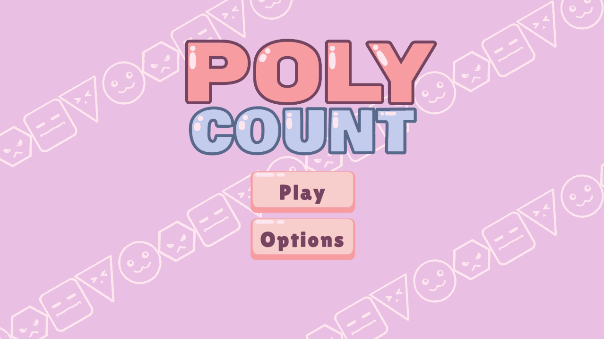
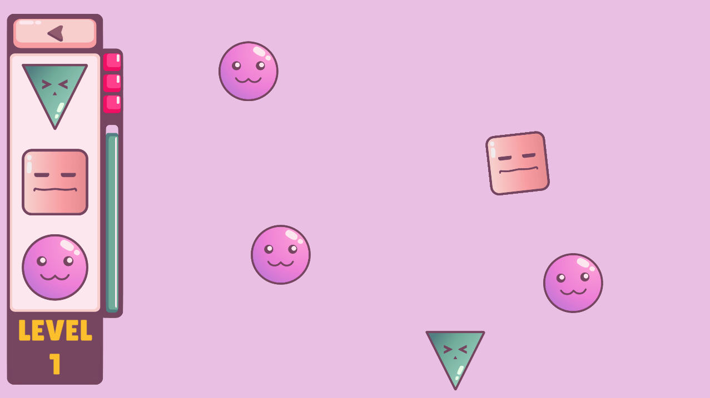
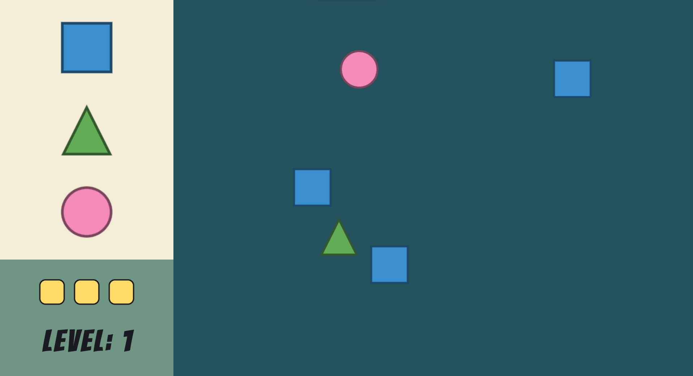
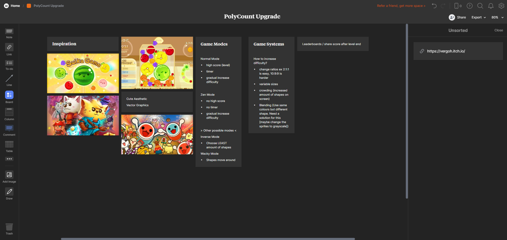
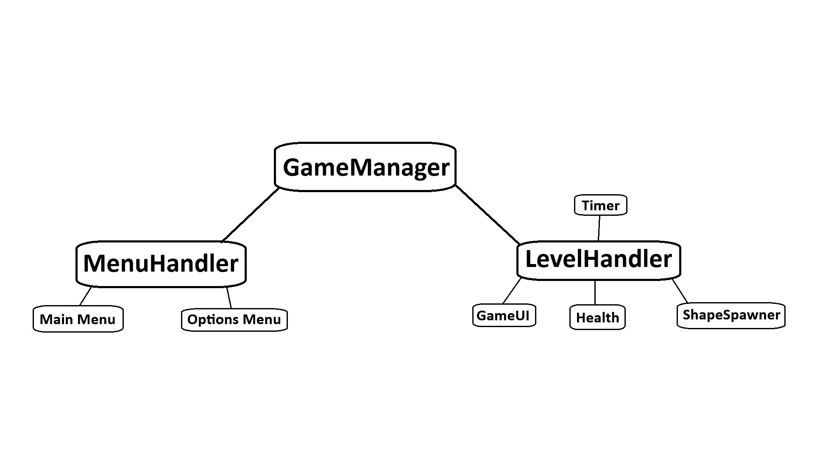

# PolyCount
A game about choosing the shape that appears the most! Initially made for Bigmode Game Jam 2023. This repo includes post game jam updates.

**Link to project:** https://vergoh.itch.io/polycount

## Screenshots

## How It's Made:

**Tech used:** Unity, Vectr, Gimp, Vscode, Beepbox, Milanote

This game was build in Unity, using vscode as my main editor. All art was made in Vectr and Gimp, sounds and music were made in Beepbox. Ideas and planning were done using Milanote.

This is what the game looked like when I submitted it for the game jam. As it was my first game jam, I wanted to keep everything simple so I could produce something playable.

I started planning for my post game jam update using Milanote. I started with the look, and drew inspiration from games like Suika game, Taiko arcade game, and Cat Quest. I then came up with different types of game mode ideas, and ways to increase difficulty as the game progressed.

The code structure was made such that the main systems are losely connected through the GameManager. These systems are connected to all the individual components in the corresponding systems.

(Names don't directly correspond to named scripts)

## Optimizations:
I made heavy use of events and listeners, this made building and testing components easy. I can put in and remove components without worrying about null references that break code. I also made use of Object Pooling to handle the shape spawning, which helps performance as the shape count increases. I also made use of my SoundManager scripts that I've used throughout all my projects, which is great for static noises and playing music.
*(optional)*

## Lessons Learned:
I learned a lot about creating UI for games. I had trouble making everything consistent, and scale well when changing resolutions. I learned to keep a sprite sheet of all the art I've made, and make sure I'm making art in consistent resolutions. I also learned a lot about structuring my code, which helped with managing with code interacts with what.

## Other Links:
Check out my other games published at https://vergoh.itch.io/

LinkedIn: https://www.linkedin.com/in/julian-crisologo-406640274/
